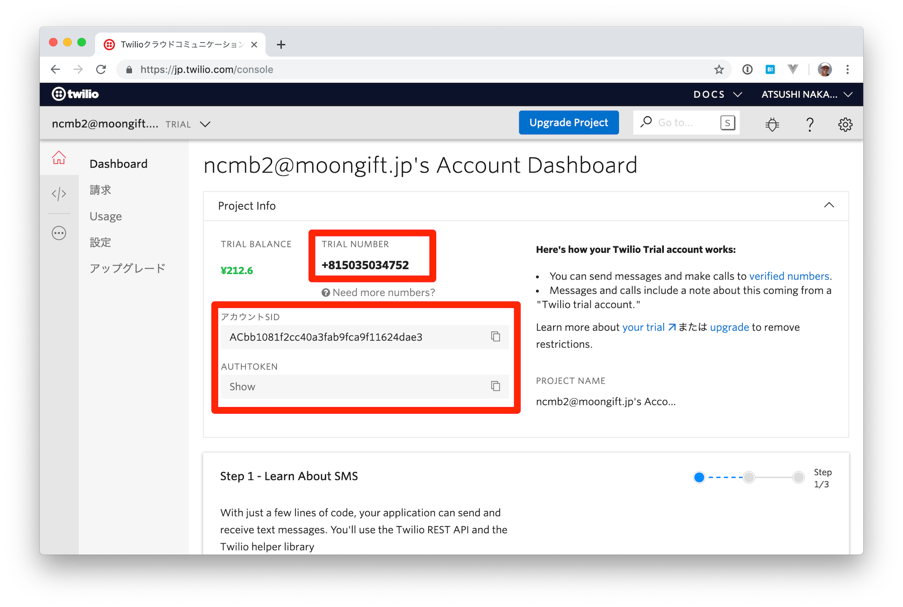
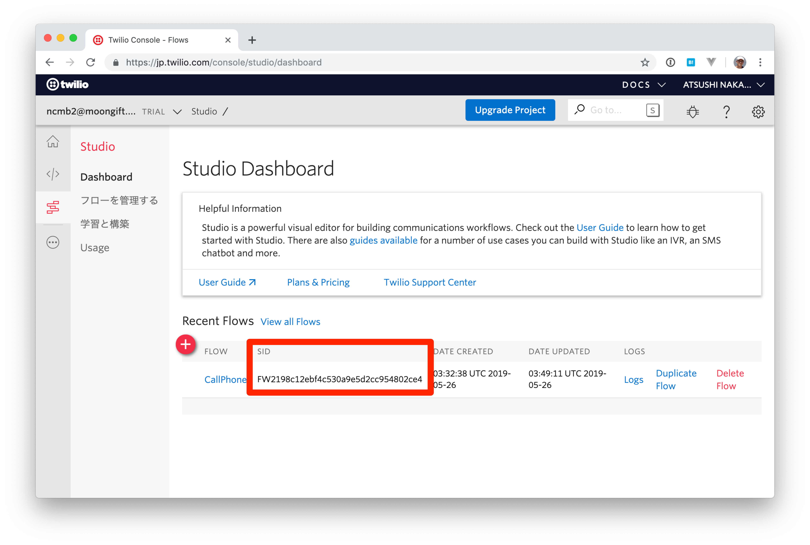
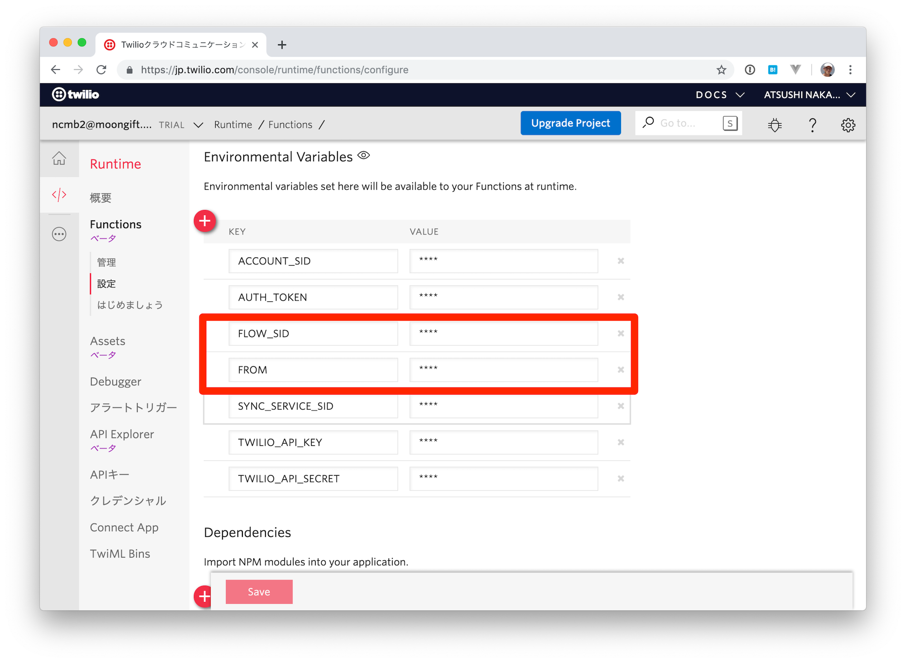
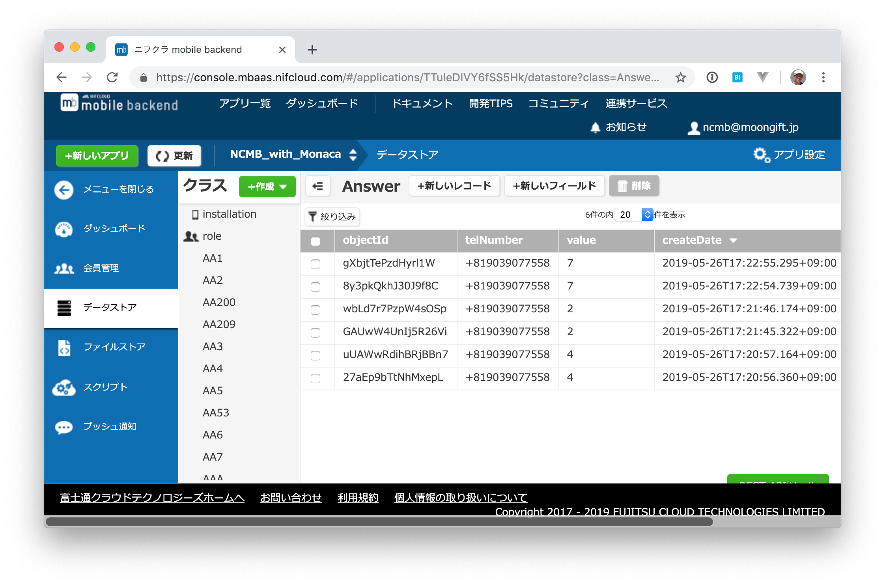

# Twilio x NCMBハンズオン（後半）

ハンズオンの後半では、いよいよMonacaアプリから電話をかけ、その結果をNCMBに保存する処理を書いていきます。全部で4つのパートに分かれています。

- 下準備
- Twilio Functionの準備
- 電話をかける
- データを保存する

## 下準備

まずベースになるMonacaアプリをインポートします。下記のURLをクリックして、プロジェクトをインポートしてください。

https://monaca.mobi/ja/directimport?pid=5cea4f52e78885dc72242c6a

無料アカウントの場合、利用できるプロジェクトは3つまでと言う制限があります。取り込めない場合は、一つプロジェクトをアーカイブしてください。

ベースになっているのはJavaScript版のOnsen UI v2 Minimumです。変更点は次の通りです。

- NCMBライブラリの追加
- Twilio Syncライブラリの追加
- jQueryの追加
- 最低限の画面作成
- js/index.jsの追加

### 固有の変数を設定

今回、環境変数が3つあります。それぞれ、TwilioとNCMBの管理画面から見つけて設定してください。

| 環境変数名 | 値 |
|----------|----------|
| applicationKey | NCMBの管理画面、右上にあるアプリ設定にあります |
| clientKey | NCMBの管理画面、右上にあるアプリ設定にあります |
| twilioUrl | [Twilio ランタイム](https://jp.twilio.com/console/runtime/overview)にてコピーできます |

## Twilio Functionの準備

Twilioの電話をかける処理はStudioで設計されています。そこで、このStudioを実行する処理を記述します。今回はTwilio Functionを使います。

### 環境変数の追加

Twilio Functionで環境変数を追加してください。

| 環境変数名 | 値 |
|----------|----------|
|FROM|購入した電話番号|
|ACCOUNT_SID|[ダッシュボードのトップページ](https://jp.twilio.com/console)でコピーできます|
|AUTH_TOKEN|[ダッシュボードのトップページ](https://jp.twilio.com/console)でコピーできます|
|FLOW_SID|[Studioのダッシュボード](https://jp.twilio.com/console/studio/dashboard)で確認できます|







### コードの追加

[Functionの管理画面](https://jp.twilio.com/console/runtime/functions/manage)に戻って、新しいファンクションを追加します（赤いプラスボタンをクリックします）。Blankで作成してください。ついで設定を次のようにします。

|設定|値|
|-----|-----|
|FUNCTION NAME|Call|
|PATH|/call|

コードは下記になります。

```js
// Twilioライブラリの読み込み
const twilio = require('twilio');

exports.handler = function(context, event, callback) {
  // Twilioクライアントの生成
  // アカウントSIDとAuthトークンを使います
  const client = new twilio(context.ACCOUNT_SID, context.AUTH_TOKEN);
  // FLOW SIDを指定して実行します
  // 電話先（to）は後ほど指定します
  client.studio.v1.flows(context.FLOW_SID).executions.create({
      to: event.to,
      from: context.FROM
  })
  .then(message => {
    // 結果を処理します
    if (event.callback) {
      // callbackという引数があれば、JSONP形式で返します
      let response = new Twilio.Response();
      response.setBody(`${event.callback}(${JSON.stringify(message)})`);
      response.appendHeader('Content-Type', 'application/javascript');
      callback(null, response);
    } else {
      // なければJSONを表示します
      callback(null, message);
    }
  })
};
```

## 電話をかける

ではMonacaアプリから電話をかけます。HTML画面にて電話をかけるボタンをクリックした時の処理をJavaScriptに記述します。下記のように書かれた部分を探してください。

```js
// コード1：Twilio Functionの呼び出し
// ここから

// ここまで
```

`ここから` の下の行に次のように記述します。toをパラメータとして送って、電話番号を指定しています。

```js
const response = $.ajax({
  url: `https://${twilioUrl}/call`,
  dataType: 'jsonp',
  data: {
    to: telNumber
  }
});
```

ここまでの処理がうまくいっていれば、ボタンを押すと電話がかけられます。

## データを保存する

電話で応対して、ボタンを押すとその結果がMonacaアプリに返ってきます。その結果をNCMBに保存します。下記のように書かれた部分を探してください。

```js
// コード2：結果をNCMBに保存
```

`// コード2：結果をNCMBに保存` の下の行に次のように記述します。

```js
const Answer = ncmb.DataStore('Answer');
const answer = new Answer;
await answer
  .set('telNumber', telNumber)
  .set('value', value)
  .save();
```

これで `Answer` というデータストアのクラスの中に、電話番号と押した値が保存されます。



----

いかがでしょうか。今回はMonacaアプリからAPI経由で電話をかけてその結果を受け取り、さらにNCMBに保存するまでの流れを体験してもらいました。電話やSMSと連携する、さらにそのデータを蓄積する際にはTwilioとNCMBを組み合わせてみてください。

